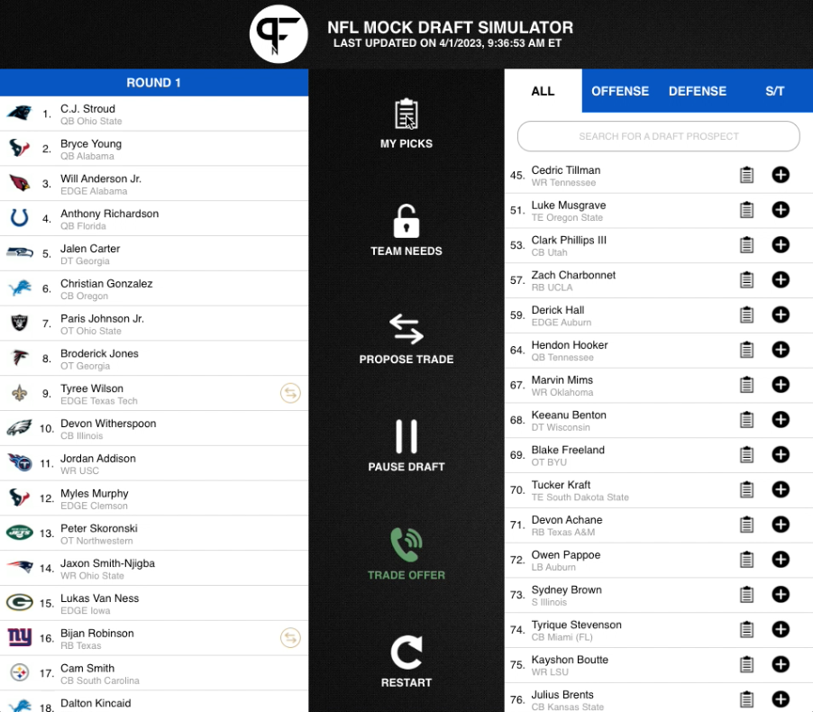
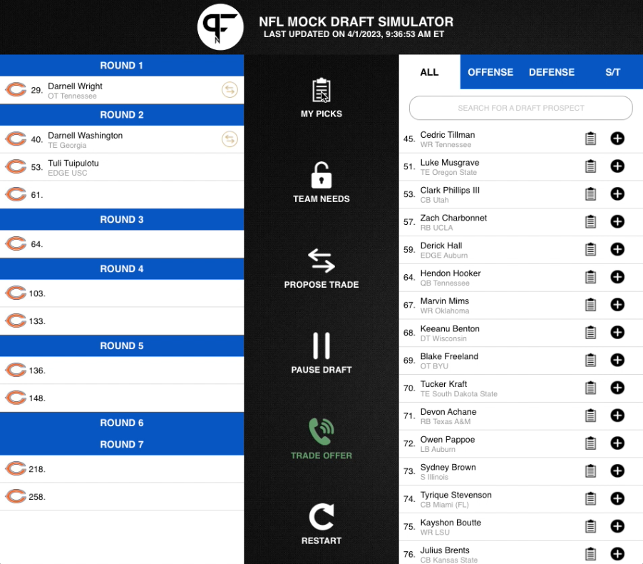
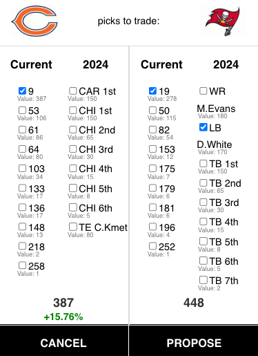

# pfn-draft-sim-tools
A tool used to make the best free mock draft tool a bit better.

Homepage: https://ebonow.github.io/pfn-mock-draft-tools/

## Description
This script can be run as a bookmarklet (a bookmark that can add some code to a webpage) that when used from the PFN Draft Simulator, will add a button option to your actions items called "MY PICKS".

Clicking this new button toggles the picks on the board between all the picks on the board and those only for your team of choice.

Additionally, all trades will now show the pick values.

Finally, some styling optimizations have been made to make the results screen more readable.

## How to use
1. Go to the site and drag the bookmark link into your bookmark bar.

2. Right-click the link in your toolbar, select "Edit" and then change the name to whatever you like (optional)

3. Start your draft and then press the bookmarklet link once it's started. You may now use the new button toggle "MY PICKS" for the selected team

NOTE: You will need to reclick this bookmarklet link everytime a new draft starts.

## TODO:
There are still a few things I would like to potentially for the ability to focus on new picks

- [ ] Better error detection for when draft screen is not active or for duplicate bookmarklet link presses
- [ ] Add support for multiple controlled teams.
- [ ] Automatically rerun the script when restarting a new draft.
- [ ] Show remaining picks numbers or selected positions near the button.
- [ ] Add styling of "MY PICKS" button when it is toggled on.
- [ ] Automatically scroll picks selection to show the current pick when toggling off "MY PICKS".
- [ ] Create this as a Chrome/Mozilla extension

## Other ideas to improve UI that I may or may not get to* 
- [ ] Highlight/select players on your board with ability to filter on those picks
- [ ] Show trade details on draft summary screen
- [ ] Find way to upload and use other big boards to add variety to drafts
- [ ] Find way to apply different big boards to different teams
- [ ] When viewing bios, find way to add links to other draft player ratings/articles
- [ ] Find way to preserve and auto-populate last trade attempt details
- [x] Find way to show Hill trade values when proposing trades
- [x] Add styling to make draft results readable and easily more sharable

*I have no idea how possible these various things would be to implement and some would be larger undertakings than others. Also the draft is coming very soon.

## Disclaimer
I am not responsible for the team at PFN changing their website in such a way that this no longer works. I am not affiliated with the fine folks there. 
# pfn-draft-sim-tools

Also as you may notice from my screenshots, I am using a custom stylesheet I wrote which allows me to see more of the screen. I might be willing to make this available as well, but am conflicted between enabling people to have a better UX and ultimately see the full list of draft results without scrolling vs promoting ways to hide their sponsors when _other sites_ have instead opted for a paywall.
