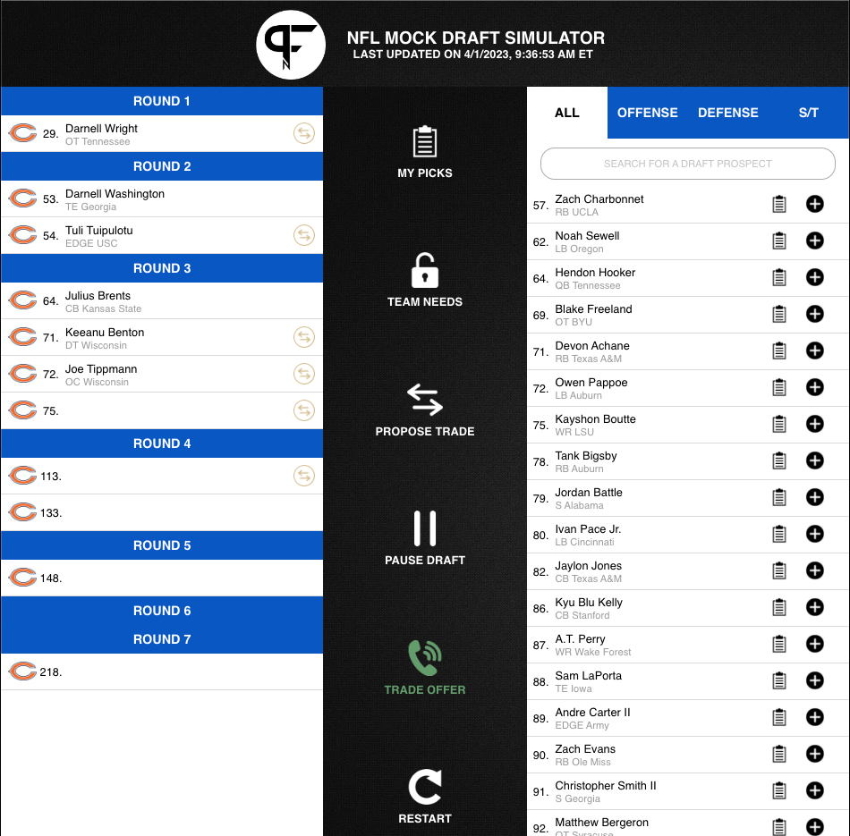

# pfn-draft-sim-tools
A tool used to make the best free mock draft tool a bit better.

## Description
This script can be run as a bookmarklet (a bookmark that can add some code to a webpage) that when used from the PFN Draft Simulator, will add a button option to your actions items called "MY PICKS". 

Clicking this new button toggles the picks on the board between all the picks on the board and those only for your team of choice.

## How to use
1. Drag this bookmarklet link into your browser toolbar for your team of choice:

> [ARI]("javascript:(function()%7Bconst%20TEAM%20%3D%20'ARI'%3B%0Alet%20toggledOn%20%3D%20false%3B%0A%0Aconst%20toggleMyPicks%20%3D%20(team)%20%3D%3E%20%7B%0A%20%20toggledOn%20%3D%20!toggledOn%3B%0A%0A%20%20const%20picks%20%3D%20document.getElementById('draft-order-list-container').getElementsByClassName('draft-card')%0A%0A%20%20const%20isMyPick%20%3D%20p%20%3D%3E%20(p.firstChild.firstChild.alt%20%3D%3D%3D%20team)%3B%0A%20%20for%20(const%20p%20of%20picks)%20%7B%0A%20%20%20%20p.style.display%20%3D%20(toggledOn%20%26%26%20!isMyPick(p))%20%3F%20'none'%20%3A%20'flex'%3B%0A%20%20%7D%0A%7D%0A%0Aconst%20btnImg%20%3D%20document.createElement('img')%3B%0AbtnImg.style.filter%20%3D%20'invert(1)'%3B%0AbtnImg.src%20%3D%20%22%2Fmockdraft%2Fsim-control-icons%2Fscouting-report-icon.png%22%3B%0A%0Aconst%20btnTxt%20%3D%20document.createElement('p')%3B%0AbtnTxt.innerText%20%3D%20'MY%20PICKS'%3B%0A%0Aconst%20newButton%20%3D%20document.createElement('button')%3B%0AnewButton.classList.add('sim-management-button-div')%3B%0AnewButton.addEventListener(%22click%22%2C%20()%20%3D%3E%20toggleMyPicks(TEAM)%2C%20false)%3B%0AnewButton.appendChild(btnImg)%3B%0AnewButton.appendChild(btnTxt)%3B%0A%0Aconst%20btnContainer%20%3D%20document.getElementById('sim-management-buttons')%3B%0AbtnContainer.prepend(newButton)%3B%7D)()%3B">)
[ATL]("javascript:(function()%7Bconst%20TEAM%20%3D%20'ATL'%3B%0Alet%20toggledOn%20%3D%20false%3B%0A%0Aconst%20toggleMyPicks%20%3D%20(team)%20%3D%3E%20%7B%0A%20%20toggledOn%20%3D%20!toggledOn%3B%0A%0A%20%20const%20picks%20%3D%20document.getElementById('draft-order-list-container').getElementsByClassName('draft-card')%0A%0A%20%20const%20isMyPick%20%3D%20p%20%3D%3E%20(p.firstChild.firstChild.alt%20%3D%3D%3D%20team)%3B%0A%20%20for%20(const%20p%20of%20picks)%20%7B%0A%20%20%20%20p.style.display%20%3D%20(toggledOn%20%26%26%20!isMyPick(p))%20%3F%20'none'%20%3A%20'flex'%3B%0A%20%20%7D%0A%7D%0A%0Aconst%20btnImg%20%3D%20document.createElement('img')%3B%0AbtnImg.style.filter%20%3D%20'invert(1)'%3B%0AbtnImg.src%20%3D%20%22%2Fmockdraft%2Fsim-control-icons%2Fscouting-report-icon.png%22%3B%0A%0Aconst%20btnTxt%20%3D%20document.createElement('p')%3B%0AbtnTxt.innerText%20%3D%20'MY%20PICKS'%3B%0A%0Aconst%20newButton%20%3D%20document.createElement('button')%3B%0AnewButton.classList.add('sim-management-button-div')%3B%0AnewButton.addEventListener(%22click%22%2C%20()%20%3D%3E%20toggleMyPicks(TEAM)%2C%20false)%3B%0AnewButton.appendChild(btnImg)%3B%0AnewButton.appendChild(btnTxt)%3B%0A%0Aconst%20btnContainer%20%3D%20document.getElementById('sim-management-buttons')%3B%0AbtnContainer.prepend(newButton)%3B%7D)()%3B">)
[BAL]("javascript:(function()%7Bconst%20TEAM%20%3D%20'BAL'%3B%0Alet%20toggledOn%20%3D%20false%3B%0A%0Aconst%20toggleMyPicks%20%3D%20(team)%20%3D%3E%20%7B%0A%20%20toggledOn%20%3D%20!toggledOn%3B%0A%0A%20%20const%20picks%20%3D%20document.getElementById('draft-order-list-container').getElementsByClassName('draft-card')%0A%0A%20%20const%20isMyPick%20%3D%20p%20%3D%3E%20(p.firstChild.firstChild.alt%20%3D%3D%3D%20team)%3B%0A%20%20for%20(const%20p%20of%20picks)%20%7B%0A%20%20%20%20p.style.display%20%3D%20(toggledOn%20%26%26%20!isMyPick(p))%20%3F%20'none'%20%3A%20'flex'%3B%0A%20%20%7D%0A%7D%0A%0Aconst%20btnImg%20%3D%20document.createElement('img')%3B%0AbtnImg.style.filter%20%3D%20'invert(1)'%3B%0AbtnImg.src%20%3D%20%22%2Fmockdraft%2Fsim-control-icons%2Fscouting-report-icon.png%22%3B%0A%0Aconst%20btnTxt%20%3D%20document.createElement('p')%3B%0AbtnTxt.innerText%20%3D%20'MY%20PICKS'%3B%0A%0Aconst%20newButton%20%3D%20document.createElement('button')%3B%0AnewButton.classList.add('sim-management-button-div')%3B%0AnewButton.addEventListener(%22click%22%2C%20()%20%3D%3E%20toggleMyPicks(TEAM)%2C%20false)%3B%0AnewButton.appendChild(btnImg)%3B%0AnewButton.appendChild(btnTxt)%3B%0A%0Aconst%20btnContainer%20%3D%20document.getElementById('sim-management-buttons')%3B%0AbtnContainer.prepend(newButton)%3B%7D)()%3B">)
[BUF]("javascript:(function()%7Bconst%20TEAM%20%3D%20'BUF'%3B%0Alet%20toggledOn%20%3D%20false%3B%0A%0Aconst%20toggleMyPicks%20%3D%20(team)%20%3D%3E%20%7B%0A%20%20toggledOn%20%3D%20!toggledOn%3B%0A%0A%20%20const%20picks%20%3D%20document.getElementById('draft-order-list-container').getElementsByClassName('draft-card')%0A%0A%20%20const%20isMyPick%20%3D%20p%20%3D%3E%20(p.firstChild.firstChild.alt%20%3D%3D%3D%20team)%3B%0A%20%20for%20(const%20p%20of%20picks)%20%7B%0A%20%20%20%20p.style.display%20%3D%20(toggledOn%20%26%26%20!isMyPick(p))%20%3F%20'none'%20%3A%20'flex'%3B%0A%20%20%7D%0A%7D%0A%0Aconst%20btnImg%20%3D%20document.createElement('img')%3B%0AbtnImg.style.filter%20%3D%20'invert(1)'%3B%0AbtnImg.src%20%3D%20%22%2Fmockdraft%2Fsim-control-icons%2Fscouting-report-icon.png%22%3B%0A%0Aconst%20btnTxt%20%3D%20document.createElement('p')%3B%0AbtnTxt.innerText%20%3D%20'MY%20PICKS'%3B%0A%0Aconst%20newButton%20%3D%20document.createElement('button')%3B%0AnewButton.classList.add('sim-management-button-div')%3B%0AnewButton.addEventListener(%22click%22%2C%20()%20%3D%3E%20toggleMyPicks(TEAM)%2C%20false)%3B%0AnewButton.appendChild(btnImg)%3B%0AnewButton.appendChild(btnTxt)%3B%0A%0Aconst%20btnContainer%20%3D%20document.getElementById('sim-management-buttons')%3B%0AbtnContainer.prepend(newButton)%3B%7D)()%3B">)
[CAR]("javascript:(function()%7Bconst%20TEAM%20%3D%20'CAR'%3B%0Alet%20toggledOn%20%3D%20false%3B%0A%0Aconst%20toggleMyPicks%20%3D%20(team)%20%3D%3E%20%7B%0A%20%20toggledOn%20%3D%20!toggledOn%3B%0A%0A%20%20const%20picks%20%3D%20document.getElementById('draft-order-list-container').getElementsByClassName('draft-card')%0A%0A%20%20const%20isMyPick%20%3D%20p%20%3D%3E%20(p.firstChild.firstChild.alt%20%3D%3D%3D%20team)%3B%0A%20%20for%20(const%20p%20of%20picks)%20%7B%0A%20%20%20%20p.style.display%20%3D%20(toggledOn%20%26%26%20!isMyPick(p))%20%3F%20'none'%20%3A%20'flex'%3B%0A%20%20%7D%0A%7D%0A%0Aconst%20btnImg%20%3D%20document.createElement('img')%3B%0AbtnImg.style.filter%20%3D%20'invert(1)'%3B%0AbtnImg.src%20%3D%20%22%2Fmockdraft%2Fsim-control-icons%2Fscouting-report-icon.png%22%3B%0A%0Aconst%20btnTxt%20%3D%20document.createElement('p')%3B%0AbtnTxt.innerText%20%3D%20'MY%20PICKS'%3B%0A%0Aconst%20newButton%20%3D%20document.createElement('button')%3B%0AnewButton.classList.add('sim-management-button-div')%3B%0AnewButton.addEventListener(%22click%22%2C%20()%20%3D%3E%20toggleMyPicks(TEAM)%2C%20false)%3B%0AnewButton.appendChild(btnImg)%3B%0AnewButton.appendChild(btnTxt)%3B%0A%0Aconst%20btnContainer%20%3D%20document.getElementById('sim-management-buttons')%3B%0AbtnContainer.prepend(newButton)%3B%7D)()%3B">)
[CHI]("javascript:(function()%7Bconst%20TEAM%20%3D%20'CHI'%3B%0Alet%20toggledOn%20%3D%20false%3B%0A%0Aconst%20toggleMyPicks%20%3D%20(team)%20%3D%3E%20%7B%0A%20%20toggledOn%20%3D%20!toggledOn%3B%0A%0A%20%20const%20picks%20%3D%20document.getElementById('draft-order-list-container').getElementsByClassName('draft-card')%0A%0A%20%20const%20isMyPick%20%3D%20p%20%3D%3E%20(p.firstChild.firstChild.alt%20%3D%3D%3D%20team)%3B%0A%20%20for%20(const%20p%20of%20picks)%20%7B%0A%20%20%20%20p.style.display%20%3D%20(toggledOn%20%26%26%20!isMyPick(p))%20%3F%20'none'%20%3A%20'flex'%3B%0A%20%20%7D%0A%7D%0A%0Aconst%20btnImg%20%3D%20document.createElement('img')%3B%0AbtnImg.style.filter%20%3D%20'invert(1)'%3B%0AbtnImg.src%20%3D%20%22%2Fmockdraft%2Fsim-control-icons%2Fscouting-report-icon.png%22%3B%0A%0Aconst%20btnTxt%20%3D%20document.createElement('p')%3B%0AbtnTxt.innerText%20%3D%20'MY%20PICKS'%3B%0A%0Aconst%20newButton%20%3D%20document.createElement('button')%3B%0AnewButton.classList.add('sim-management-button-div')%3B%0AnewButton.addEventListener(%22click%22%2C%20()%20%3D%3E%20toggleMyPicks(TEAM)%2C%20false)%3B%0AnewButton.appendChild(btnImg)%3B%0AnewButton.appendChild(btnTxt)%3B%0A%0Aconst%20btnContainer%20%3D%20document.getElementById('sim-management-buttons')%3B%0AbtnContainer.prepend(newButton)%3B%7D)()%3B">)
[CIN]("javascript:(function()%7Bconst%20TEAM%20%3D%20'CIN'%3B%0Alet%20toggledOn%20%3D%20false%3B%0A%0Aconst%20toggleMyPicks%20%3D%20(team)%20%3D%3E%20%7B%0A%20%20toggledOn%20%3D%20!toggledOn%3B%0A%0A%20%20const%20picks%20%3D%20document.getElementById('draft-order-list-container').getElementsByClassName('draft-card')%0A%0A%20%20const%20isMyPick%20%3D%20p%20%3D%3E%20(p.firstChild.firstChild.alt%20%3D%3D%3D%20team)%3B%0A%20%20for%20(const%20p%20of%20picks)%20%7B%0A%20%20%20%20p.style.display%20%3D%20(toggledOn%20%26%26%20!isMyPick(p))%20%3F%20'none'%20%3A%20'flex'%3B%0A%20%20%7D%0A%7D%0A%0Aconst%20btnImg%20%3D%20document.createElement('img')%3B%0AbtnImg.style.filter%20%3D%20'invert(1)'%3B%0AbtnImg.src%20%3D%20%22%2Fmockdraft%2Fsim-control-icons%2Fscouting-report-icon.png%22%3B%0A%0Aconst%20btnTxt%20%3D%20document.createElement('p')%3B%0AbtnTxt.innerText%20%3D%20'MY%20PICKS'%3B%0A%0Aconst%20newButton%20%3D%20document.createElement('button')%3B%0AnewButton.classList.add('sim-management-button-div')%3B%0AnewButton.addEventListener(%22click%22%2C%20()%20%3D%3E%20toggleMyPicks(TEAM)%2C%20false)%3B%0AnewButton.appendChild(btnImg)%3B%0AnewButton.appendChild(btnTxt)%3B%0A%0Aconst%20btnContainer%20%3D%20document.getElementById('sim-management-buttons')%3B%0AbtnContainer.prepend(newButton)%3B%7D)()%3B">)
[CLE]("javascript:(function()%7Bconst%20TEAM%20%3D%20'CLE'%3B%0Alet%20toggledOn%20%3D%20false%3B%0A%0Aconst%20toggleMyPicks%20%3D%20(team)%20%3D%3E%20%7B%0A%20%20toggledOn%20%3D%20!toggledOn%3B%0A%0A%20%20const%20picks%20%3D%20document.getElementById('draft-order-list-container').getElementsByClassName('draft-card')%0A%0A%20%20const%20isMyPick%20%3D%20p%20%3D%3E%20(p.firstChild.firstChild.alt%20%3D%3D%3D%20team)%3B%0A%20%20for%20(const%20p%20of%20picks)%20%7B%0A%20%20%20%20p.style.display%20%3D%20(toggledOn%20%26%26%20!isMyPick(p))%20%3F%20'none'%20%3A%20'flex'%3B%0A%20%20%7D%0A%7D%0A%0Aconst%20btnImg%20%3D%20document.createElement('img')%3B%0AbtnImg.style.filter%20%3D%20'invert(1)'%3B%0AbtnImg.src%20%3D%20%22%2Fmockdraft%2Fsim-control-icons%2Fscouting-report-icon.png%22%3B%0A%0Aconst%20btnTxt%20%3D%20document.createElement('p')%3B%0AbtnTxt.innerText%20%3D%20'MY%20PICKS'%3B%0A%0Aconst%20newButton%20%3D%20document.createElement('button')%3B%0AnewButton.classList.add('sim-management-button-div')%3B%0AnewButton.addEventListener(%22click%22%2C%20()%20%3D%3E%20toggleMyPicks(TEAM)%2C%20false)%3B%0AnewButton.appendChild(btnImg)%3B%0AnewButton.appendChild(btnTxt)%3B%0A%0Aconst%20btnContainer%20%3D%20document.getElementById('sim-management-buttons')%3B%0AbtnContainer.prepend(newButton)%3B%7D)()%3B">)
[DAL]("javascript:(function()%7Bconst%20TEAM%20%3D%20'DAL'%3B%0Alet%20toggledOn%20%3D%20false%3B%0A%0Aconst%20toggleMyPicks%20%3D%20(team)%20%3D%3E%20%7B%0A%20%20toggledOn%20%3D%20!toggledOn%3B%0A%0A%20%20const%20picks%20%3D%20document.getElementById('draft-order-list-container').getElementsByClassName('draft-card')%0A%0A%20%20const%20isMyPick%20%3D%20p%20%3D%3E%20(p.firstChild.firstChild.alt%20%3D%3D%3D%20team)%3B%0A%20%20for%20(const%20p%20of%20picks)%20%7B%0A%20%20%20%20p.style.display%20%3D%20(toggledOn%20%26%26%20!isMyPick(p))%20%3F%20'none'%20%3A%20'flex'%3B%0A%20%20%7D%0A%7D%0A%0Aconst%20btnImg%20%3D%20document.createElement('img')%3B%0AbtnImg.style.filter%20%3D%20'invert(1)'%3B%0AbtnImg.src%20%3D%20%22%2Fmockdraft%2Fsim-control-icons%2Fscouting-report-icon.png%22%3B%0A%0Aconst%20btnTxt%20%3D%20document.createElement('p')%3B%0AbtnTxt.innerText%20%3D%20'MY%20PICKS'%3B%0A%0Aconst%20newButton%20%3D%20document.createElement('button')%3B%0AnewButton.classList.add('sim-management-button-div')%3B%0AnewButton.addEventListener(%22click%22%2C%20()%20%3D%3E%20toggleMyPicks(TEAM)%2C%20false)%3B%0AnewButton.appendChild(btnImg)%3B%0AnewButton.appendChild(btnTxt)%3B%0A%0Aconst%20btnContainer%20%3D%20document.getElementById('sim-management-buttons')%3B%0AbtnContainer.prepend(newButton)%3B%7D)()%3B">)
[DEN]("javascript:(function()%7Bconst%20TEAM%20%3D%20'DEN'%3B%0Alet%20toggledOn%20%3D%20false%3B%0A%0Aconst%20toggleMyPicks%20%3D%20(team)%20%3D%3E%20%7B%0A%20%20toggledOn%20%3D%20!toggledOn%3B%0A%0A%20%20const%20picks%20%3D%20document.getElementById('draft-order-list-container').getElementsByClassName('draft-card')%0A%0A%20%20const%20isMyPick%20%3D%20p%20%3D%3E%20(p.firstChild.firstChild.alt%20%3D%3D%3D%20team)%3B%0A%20%20for%20(const%20p%20of%20picks)%20%7B%0A%20%20%20%20p.style.display%20%3D%20(toggledOn%20%26%26%20!isMyPick(p))%20%3F%20'none'%20%3A%20'flex'%3B%0A%20%20%7D%0A%7D%0A%0Aconst%20btnImg%20%3D%20document.createElement('img')%3B%0AbtnImg.style.filter%20%3D%20'invert(1)'%3B%0AbtnImg.src%20%3D%20%22%2Fmockdraft%2Fsim-control-icons%2Fscouting-report-icon.png%22%3B%0A%0Aconst%20btnTxt%20%3D%20document.createElement('p')%3B%0AbtnTxt.innerText%20%3D%20'MY%20PICKS'%3B%0A%0Aconst%20newButton%20%3D%20document.createElement('button')%3B%0AnewButton.classList.add('sim-management-button-div')%3B%0AnewButton.addEventListener(%22click%22%2C%20()%20%3D%3E%20toggleMyPicks(TEAM)%2C%20false)%3B%0AnewButton.appendChild(btnImg)%3B%0AnewButton.appendChild(btnTxt)%3B%0A%0Aconst%20btnContainer%20%3D%20document.getElementById('sim-management-buttons')%3B%0AbtnContainer.prepend(newButton)%3B%7D)()%3B">)
[DET]("javascript:(function()%7Bconst%20TEAM%20%3D%20'DET'%3B%0Alet%20toggledOn%20%3D%20false%3B%0A%0Aconst%20toggleMyPicks%20%3D%20(team)%20%3D%3E%20%7B%0A%20%20toggledOn%20%3D%20!toggledOn%3B%0A%0A%20%20const%20picks%20%3D%20document.getElementById('draft-order-list-container').getElementsByClassName('draft-card')%0A%0A%20%20const%20isMyPick%20%3D%20p%20%3D%3E%20(p.firstChild.firstChild.alt%20%3D%3D%3D%20team)%3B%0A%20%20for%20(const%20p%20of%20picks)%20%7B%0A%20%20%20%20p.style.display%20%3D%20(toggledOn%20%26%26%20!isMyPick(p))%20%3F%20'none'%20%3A%20'flex'%3B%0A%20%20%7D%0A%7D%0A%0Aconst%20btnImg%20%3D%20document.createElement('img')%3B%0AbtnImg.style.filter%20%3D%20'invert(1)'%3B%0AbtnImg.src%20%3D%20%22%2Fmockdraft%2Fsim-control-icons%2Fscouting-report-icon.png%22%3B%0A%0Aconst%20btnTxt%20%3D%20document.createElement('p')%3B%0AbtnTxt.innerText%20%3D%20'MY%20PICKS'%3B%0A%0Aconst%20newButton%20%3D%20document.createElement('button')%3B%0AnewButton.classList.add('sim-management-button-div')%3B%0AnewButton.addEventListener(%22click%22%2C%20()%20%3D%3E%20toggleMyPicks(TEAM)%2C%20false)%3B%0AnewButton.appendChild(btnImg)%3B%0AnewButton.appendChild(btnTxt)%3B%0A%0Aconst%20btnContainer%20%3D%20document.getElementById('sim-management-buttons')%3B%0AbtnContainer.prepend(newButton)%3B%7D)()%3B">)
[GB]("javascript:(function()%7Bconst%20TEAM%20%3D%20'GB'%3B%0Alet%20toggledOn%20%3D%20false%3B%0A%0Aconst%20toggleMyPicks%20%3D%20(team)%20%3D%3E%20%7B%0A%20%20toggledOn%20%3D%20!toggledOn%3B%0A%0A%20%20const%20picks%20%3D%20document.getElementById('draft-order-list-container').getElementsByClassName('draft-card')%0A%0A%20%20const%20isMyPick%20%3D%20p%20%3D%3E%20(p.firstChild.firstChild.alt%20%3D%3D%3D%20team)%3B%0A%20%20for%20(const%20p%20of%20picks)%20%7B%0A%20%20%20%20p.style.display%20%3D%20(toggledOn%20%26%26%20!isMyPick(p))%20%3F%20'none'%20%3A%20'flex'%3B%0A%20%20%7D%0A%7D%0A%0Aconst%20btnImg%20%3D%20document.createElement('img')%3B%0AbtnImg.style.filter%20%3D%20'invert(1)'%3B%0AbtnImg.src%20%3D%20%22%2Fmockdraft%2Fsim-control-icons%2Fscouting-report-icon.png%22%3B%0A%0Aconst%20btnTxt%20%3D%20document.createElement('p')%3B%0AbtnTxt.innerText%20%3D%20'MY%20PICKS'%3B%0A%0Aconst%20newButton%20%3D%20document.createElement('button')%3B%0AnewButton.classList.add('sim-management-button-div')%3B%0AnewButton.addEventListener(%22click%22%2C%20()%20%3D%3E%20toggleMyPicks(TEAM)%2C%20false)%3B%0AnewButton.appendChild(btnImg)%3B%0AnewButton.appendChild(btnTxt)%3B%0A%0Aconst%20btnContainer%20%3D%20document.getElementById('sim-management-buttons')%3B%0AbtnContainer.prepend(newButton)%3B%7D)()%3B">)
[HOU]("javascript:(function()%7Bconst%20TEAM%20%3D%20'HOU'%3B%0Alet%20toggledOn%20%3D%20false%3B%0A%0Aconst%20toggleMyPicks%20%3D%20(team)%20%3D%3E%20%7B%0A%20%20toggledOn%20%3D%20!toggledOn%3B%0A%0A%20%20const%20picks%20%3D%20document.getElementById('draft-order-list-container').getElementsByClassName('draft-card')%0A%0A%20%20const%20isMyPick%20%3D%20p%20%3D%3E%20(p.firstChild.firstChild.alt%20%3D%3D%3D%20team)%3B%0A%20%20for%20(const%20p%20of%20picks)%20%7B%0A%20%20%20%20p.style.display%20%3D%20(toggledOn%20%26%26%20!isMyPick(p))%20%3F%20'none'%20%3A%20'flex'%3B%0A%20%20%7D%0A%7D%0A%0Aconst%20btnImg%20%3D%20document.createElement('img')%3B%0AbtnImg.style.filter%20%3D%20'invert(1)'%3B%0AbtnImg.src%20%3D%20%22%2Fmockdraft%2Fsim-control-icons%2Fscouting-report-icon.png%22%3B%0A%0Aconst%20btnTxt%20%3D%20document.createElement('p')%3B%0AbtnTxt.innerText%20%3D%20'MY%20PICKS'%3B%0A%0Aconst%20newButton%20%3D%20document.createElement('button')%3B%0AnewButton.classList.add('sim-management-button-div')%3B%0AnewButton.addEventListener(%22click%22%2C%20()%20%3D%3E%20toggleMyPicks(TEAM)%2C%20false)%3B%0AnewButton.appendChild(btnImg)%3B%0AnewButton.appendChild(btnTxt)%3B%0A%0Aconst%20btnContainer%20%3D%20document.getElementById('sim-management-buttons')%3B%0AbtnContainer.prepend(newButton)%3B%7D)()%3B">)
[IND]("javascript:(function()%7Bconst%20TEAM%20%3D%20'IND'%3B%0Alet%20toggledOn%20%3D%20false%3B%0A%0Aconst%20toggleMyPicks%20%3D%20(team)%20%3D%3E%20%7B%0A%20%20toggledOn%20%3D%20!toggledOn%3B%0A%0A%20%20const%20picks%20%3D%20document.getElementById('draft-order-list-container').getElementsByClassName('draft-card')%0A%0A%20%20const%20isMyPick%20%3D%20p%20%3D%3E%20(p.firstChild.firstChild.alt%20%3D%3D%3D%20team)%3B%0A%20%20for%20(const%20p%20of%20picks)%20%7B%0A%20%20%20%20p.style.display%20%3D%20(toggledOn%20%26%26%20!isMyPick(p))%20%3F%20'none'%20%3A%20'flex'%3B%0A%20%20%7D%0A%7D%0A%0Aconst%20btnImg%20%3D%20document.createElement('img')%3B%0AbtnImg.style.filter%20%3D%20'invert(1)'%3B%0AbtnImg.src%20%3D%20%22%2Fmockdraft%2Fsim-control-icons%2Fscouting-report-icon.png%22%3B%0A%0Aconst%20btnTxt%20%3D%20document.createElement('p')%3B%0AbtnTxt.innerText%20%3D%20'MY%20PICKS'%3B%0A%0Aconst%20newButton%20%3D%20document.createElement('button')%3B%0AnewButton.classList.add('sim-management-button-div')%3B%0AnewButton.addEventListener(%22click%22%2C%20()%20%3D%3E%20toggleMyPicks(TEAM)%2C%20false)%3B%0AnewButton.appendChild(btnImg)%3B%0AnewButton.appendChild(btnTxt)%3B%0A%0Aconst%20btnContainer%20%3D%20document.getElementById('sim-management-buttons')%3B%0AbtnContainer.prepend(newButton)%3B%7D)()%3B">)
[JAX]("javascript:(function()%7Bconst%20TEAM%20%3D%20'JAX'%3B%0Alet%20toggledOn%20%3D%20false%3B%0A%0Aconst%20toggleMyPicks%20%3D%20(team)%20%3D%3E%20%7B%0A%20%20toggledOn%20%3D%20!toggledOn%3B%0A%0A%20%20const%20picks%20%3D%20document.getElementById('draft-order-list-container').getElementsByClassName('draft-card')%0A%0A%20%20const%20isMyPick%20%3D%20p%20%3D%3E%20(p.firstChild.firstChild.alt%20%3D%3D%3D%20team)%3B%0A%20%20for%20(const%20p%20of%20picks)%20%7B%0A%20%20%20%20p.style.display%20%3D%20(toggledOn%20%26%26%20!isMyPick(p))%20%3F%20'none'%20%3A%20'flex'%3B%0A%20%20%7D%0A%7D%0A%0Aconst%20btnImg%20%3D%20document.createElement('img')%3B%0AbtnImg.style.filter%20%3D%20'invert(1)'%3B%0AbtnImg.src%20%3D%20%22%2Fmockdraft%2Fsim-control-icons%2Fscouting-report-icon.png%22%3B%0A%0Aconst%20btnTxt%20%3D%20document.createElement('p')%3B%0AbtnTxt.innerText%20%3D%20'MY%20PICKS'%3B%0A%0Aconst%20newButton%20%3D%20document.createElement('button')%3B%0AnewButton.classList.add('sim-management-button-div')%3B%0AnewButton.addEventListener(%22click%22%2C%20()%20%3D%3E%20toggleMyPicks(TEAM)%2C%20false)%3B%0AnewButton.appendChild(btnImg)%3B%0AnewButton.appendChild(btnTxt)%3B%0A%0Aconst%20btnContainer%20%3D%20document.getElementById('sim-management-buttons')%3B%0AbtnContainer.prepend(newButton)%3B%7D)()%3B">)
[KC]("javascript:(function()%7Bconst%20TEAM%20%3D%20'KC'%3B%0Alet%20toggledOn%20%3D%20false%3B%0A%0Aconst%20toggleMyPicks%20%3D%20(team)%20%3D%3E%20%7B%0A%20%20toggledOn%20%3D%20!toggledOn%3B%0A%0A%20%20const%20picks%20%3D%20document.getElementById('draft-order-list-container').getElementsByClassName('draft-card')%0A%0A%20%20const%20isMyPick%20%3D%20p%20%3D%3E%20(p.firstChild.firstChild.alt%20%3D%3D%3D%20team)%3B%0A%20%20for%20(const%20p%20of%20picks)%20%7B%0A%20%20%20%20p.style.display%20%3D%20(toggledOn%20%26%26%20!isMyPick(p))%20%3F%20'none'%20%3A%20'flex'%3B%0A%20%20%7D%0A%7D%0A%0Aconst%20btnImg%20%3D%20document.createElement('img')%3B%0AbtnImg.style.filter%20%3D%20'invert(1)'%3B%0AbtnImg.src%20%3D%20%22%2Fmockdraft%2Fsim-control-icons%2Fscouting-report-icon.png%22%3B%0A%0Aconst%20btnTxt%20%3D%20document.createElement('p')%3B%0AbtnTxt.innerText%20%3D%20'MY%20PICKS'%3B%0A%0Aconst%20newButton%20%3D%20document.createElement('button')%3B%0AnewButton.classList.add('sim-management-button-div')%3B%0AnewButton.addEventListener(%22click%22%2C%20()%20%3D%3E%20toggleMyPicks(TEAM)%2C%20false)%3B%0AnewButton.appendChild(btnImg)%3B%0AnewButton.appendChild(btnTxt)%3B%0A%0Aconst%20btnContainer%20%3D%20document.getElementById('sim-management-buttons')%3B%0AbtnContainer.prepend(newButton)%3B%7D)()%3B">)
> 
> [LAC]("javascript:(function()%7Bconst%20TEAM%20%3D%20'LAC'%3B%0Alet%20toggledOn%20%3D%20false%3B%0A%0Aconst%20toggleMyPicks%20%3D%20(team)%20%3D%3E%20%7B%0A%20%20toggledOn%20%3D%20!toggledOn%3B%0A%0A%20%20const%20picks%20%3D%20document.getElementById('draft-order-list-container').getElementsByClassName('draft-card')%0A%0A%20%20const%20isMyPick%20%3D%20p%20%3D%3E%20(p.firstChild.firstChild.alt%20%3D%3D%3D%20team)%3B%0A%20%20for%20(const%20p%20of%20picks)%20%7B%0A%20%20%20%20p.style.display%20%3D%20(toggledOn%20%26%26%20!isMyPick(p))%20%3F%20'none'%20%3A%20'flex'%3B%0A%20%20%7D%0A%7D%0A%0Aconst%20btnImg%20%3D%20document.createElement('img')%3B%0AbtnImg.style.filter%20%3D%20'invert(1)'%3B%0AbtnImg.src%20%3D%20%22%2Fmockdraft%2Fsim-control-icons%2Fscouting-report-icon.png%22%3B%0A%0Aconst%20btnTxt%20%3D%20document.createElement('p')%3B%0AbtnTxt.innerText%20%3D%20'MY%20PICKS'%3B%0A%0Aconst%20newButton%20%3D%20document.createElement('button')%3B%0AnewButton.classList.add('sim-management-button-div')%3B%0AnewButton.addEventListener(%22click%22%2C%20()%20%3D%3E%20toggleMyPicks(TEAM)%2C%20false)%3B%0AnewButton.appendChild(btnImg)%3B%0AnewButton.appendChild(btnTxt)%3B%0A%0Aconst%20btnContainer%20%3D%20document.getElementById('sim-management-buttons')%3B%0AbtnContainer.prepend(newButton)%3B%7D)()%3B">)
[LAR]("javascript:(function()%7Bconst%20TEAM%20%3D%20'LAR'%3B%0Alet%20toggledOn%20%3D%20false%3B%0A%0Aconst%20toggleMyPicks%20%3D%20(team)%20%3D%3E%20%7B%0A%20%20toggledOn%20%3D%20!toggledOn%3B%0A%0A%20%20const%20picks%20%3D%20document.getElementById('draft-order-list-container').getElementsByClassName('draft-card')%0A%0A%20%20const%20isMyPick%20%3D%20p%20%3D%3E%20(p.firstChild.firstChild.alt%20%3D%3D%3D%20team)%3B%0A%20%20for%20(const%20p%20of%20picks)%20%7B%0A%20%20%20%20p.style.display%20%3D%20(toggledOn%20%26%26%20!isMyPick(p))%20%3F%20'none'%20%3A%20'flex'%3B%0A%20%20%7D%0A%7D%0A%0Aconst%20btnImg%20%3D%20document.createElement('img')%3B%0AbtnImg.style.filter%20%3D%20'invert(1)'%3B%0AbtnImg.src%20%3D%20%22%2Fmockdraft%2Fsim-control-icons%2Fscouting-report-icon.png%22%3B%0A%0Aconst%20btnTxt%20%3D%20document.createElement('p')%3B%0AbtnTxt.innerText%20%3D%20'MY%20PICKS'%3B%0A%0Aconst%20newButton%20%3D%20document.createElement('button')%3B%0AnewButton.classList.add('sim-management-button-div')%3B%0AnewButton.addEventListener(%22click%22%2C%20()%20%3D%3E%20toggleMyPicks(TEAM)%2C%20false)%3B%0AnewButton.appendChild(btnImg)%3B%0AnewButton.appendChild(btnTxt)%3B%0A%0Aconst%20btnContainer%20%3D%20document.getElementById('sim-management-buttons')%3B%0AbtnContainer.prepend(newButton)%3B%7D)()%3B">)
[LV]("javascript:(function()%7Bconst%20TEAM%20%3D%20'LV'%3B%0Alet%20toggledOn%20%3D%20false%3B%0A%0Aconst%20toggleMyPicks%20%3D%20(team)%20%3D%3E%20%7B%0A%20%20toggledOn%20%3D%20!toggledOn%3B%0A%0A%20%20const%20picks%20%3D%20document.getElementById('draft-order-list-container').getElementsByClassName('draft-card')%0A%0A%20%20const%20isMyPick%20%3D%20p%20%3D%3E%20(p.firstChild.firstChild.alt%20%3D%3D%3D%20team)%3B%0A%20%20for%20(const%20p%20of%20picks)%20%7B%0A%20%20%20%20p.style.display%20%3D%20(toggledOn%20%26%26%20!isMyPick(p))%20%3F%20'none'%20%3A%20'flex'%3B%0A%20%20%7D%0A%7D%0A%0Aconst%20btnImg%20%3D%20document.createElement('img')%3B%0AbtnImg.style.filter%20%3D%20'invert(1)'%3B%0AbtnImg.src%20%3D%20%22%2Fmockdraft%2Fsim-control-icons%2Fscouting-report-icon.png%22%3B%0A%0Aconst%20btnTxt%20%3D%20document.createElement('p')%3B%0AbtnTxt.innerText%20%3D%20'MY%20PICKS'%3B%0A%0Aconst%20newButton%20%3D%20document.createElement('button')%3B%0AnewButton.classList.add('sim-management-button-div')%3B%0AnewButton.addEventListener(%22click%22%2C%20()%20%3D%3E%20toggleMyPicks(TEAM)%2C%20false)%3B%0AnewButton.appendChild(btnImg)%3B%0AnewButton.appendChild(btnTxt)%3B%0A%0Aconst%20btnContainer%20%3D%20document.getElementById('sim-management-buttons')%3B%0AbtnContainer.prepend(newButton)%3B%7D)()%3B">)
[MIA]("javascript:(function()%7Bconst%20TEAM%20%3D%20'MIA'%3B%0Alet%20toggledOn%20%3D%20false%3B%0A%0Aconst%20toggleMyPicks%20%3D%20(team)%20%3D%3E%20%7B%0A%20%20toggledOn%20%3D%20!toggledOn%3B%0A%0A%20%20const%20picks%20%3D%20document.getElementById('draft-order-list-container').getElementsByClassName('draft-card')%0A%0A%20%20const%20isMyPick%20%3D%20p%20%3D%3E%20(p.firstChild.firstChild.alt%20%3D%3D%3D%20team)%3B%0A%20%20for%20(const%20p%20of%20picks)%20%7B%0A%20%20%20%20p.style.display%20%3D%20(toggledOn%20%26%26%20!isMyPick(p))%20%3F%20'none'%20%3A%20'flex'%3B%0A%20%20%7D%0A%7D%0A%0Aconst%20btnImg%20%3D%20document.createElement('img')%3B%0AbtnImg.style.filter%20%3D%20'invert(1)'%3B%0AbtnImg.src%20%3D%20%22%2Fmockdraft%2Fsim-control-icons%2Fscouting-report-icon.png%22%3B%0A%0Aconst%20btnTxt%20%3D%20document.createElement('p')%3B%0AbtnTxt.innerText%20%3D%20'MY%20PICKS'%3B%0A%0Aconst%20newButton%20%3D%20document.createElement('button')%3B%0AnewButton.classList.add('sim-management-button-div')%3B%0AnewButton.addEventListener(%22click%22%2C%20()%20%3D%3E%20toggleMyPicks(TEAM)%2C%20false)%3B%0AnewButton.appendChild(btnImg)%3B%0AnewButton.appendChild(btnTxt)%3B%0A%0Aconst%20btnContainer%20%3D%20document.getElementById('sim-management-buttons')%3B%0AbtnContainer.prepend(newButton)%3B%7D)()%3B">)
[MIN]("javascript:(function()%7Bconst%20TEAM%20%3D%20'MIN'%3B%0Alet%20toggledOn%20%3D%20false%3B%0A%0Aconst%20toggleMyPicks%20%3D%20(team)%20%3D%3E%20%7B%0A%20%20toggledOn%20%3D%20!toggledOn%3B%0A%0A%20%20const%20picks%20%3D%20document.getElementById('draft-order-list-container').getElementsByClassName('draft-card')%0A%0A%20%20const%20isMyPick%20%3D%20p%20%3D%3E%20(p.firstChild.firstChild.alt%20%3D%3D%3D%20team)%3B%0A%20%20for%20(const%20p%20of%20picks)%20%7B%0A%20%20%20%20p.style.display%20%3D%20(toggledOn%20%26%26%20!isMyPick(p))%20%3F%20'none'%20%3A%20'flex'%3B%0A%20%20%7D%0A%7D%0A%0Aconst%20btnImg%20%3D%20document.createElement('img')%3B%0AbtnImg.style.filter%20%3D%20'invert(1)'%3B%0AbtnImg.src%20%3D%20%22%2Fmockdraft%2Fsim-control-icons%2Fscouting-report-icon.png%22%3B%0A%0Aconst%20btnTxt%20%3D%20document.createElement('p')%3B%0AbtnTxt.innerText%20%3D%20'MY%20PICKS'%3B%0A%0Aconst%20newButton%20%3D%20document.createElement('button')%3B%0AnewButton.classList.add('sim-management-button-div')%3B%0AnewButton.addEventListener(%22click%22%2C%20()%20%3D%3E%20toggleMyPicks(TEAM)%2C%20false)%3B%0AnewButton.appendChild(btnImg)%3B%0AnewButton.appendChild(btnTxt)%3B%0A%0Aconst%20btnContainer%20%3D%20document.getElementById('sim-management-buttons')%3B%0AbtnContainer.prepend(newButton)%3B%7D)()%3B">)
[NE]("javascript:(function()%7Bconst%20TEAM%20%3D%20'NE'%3B%0Alet%20toggledOn%20%3D%20false%3B%0A%0Aconst%20toggleMyPicks%20%3D%20(team)%20%3D%3E%20%7B%0A%20%20toggledOn%20%3D%20!toggledOn%3B%0A%0A%20%20const%20picks%20%3D%20document.getElementById('draft-order-list-container').getElementsByClassName('draft-card')%0A%0A%20%20const%20isMyPick%20%3D%20p%20%3D%3E%20(p.firstChild.firstChild.alt%20%3D%3D%3D%20team)%3B%0A%20%20for%20(const%20p%20of%20picks)%20%7B%0A%20%20%20%20p.style.display%20%3D%20(toggledOn%20%26%26%20!isMyPick(p))%20%3F%20'none'%20%3A%20'flex'%3B%0A%20%20%7D%0A%7D%0A%0Aconst%20btnImg%20%3D%20document.createElement('img')%3B%0AbtnImg.style.filter%20%3D%20'invert(1)'%3B%0AbtnImg.src%20%3D%20%22%2Fmockdraft%2Fsim-control-icons%2Fscouting-report-icon.png%22%3B%0A%0Aconst%20btnTxt%20%3D%20document.createElement('p')%3B%0AbtnTxt.innerText%20%3D%20'MY%20PICKS'%3B%0A%0Aconst%20newButton%20%3D%20document.createElement('button')%3B%0AnewButton.classList.add('sim-management-button-div')%3B%0AnewButton.addEventListener(%22click%22%2C%20()%20%3D%3E%20toggleMyPicks(TEAM)%2C%20false)%3B%0AnewButton.appendChild(btnImg)%3B%0AnewButton.appendChild(btnTxt)%3B%0A%0Aconst%20btnContainer%20%3D%20document.getElementById('sim-management-buttons')%3B%0AbtnContainer.prepend(newButton)%3B%7D)()%3B">)
[NO]("javascript:(function()%7Bconst%20TEAM%20%3D%20'NO'%3B%0Alet%20toggledOn%20%3D%20false%3B%0A%0Aconst%20toggleMyPicks%20%3D%20(team)%20%3D%3E%20%7B%0A%20%20toggledOn%20%3D%20!toggledOn%3B%0A%0A%20%20const%20picks%20%3D%20document.getElementById('draft-order-list-container').getElementsByClassName('draft-card')%0A%0A%20%20const%20isMyPick%20%3D%20p%20%3D%3E%20(p.firstChild.firstChild.alt%20%3D%3D%3D%20team)%3B%0A%20%20for%20(const%20p%20of%20picks)%20%7B%0A%20%20%20%20p.style.display%20%3D%20(toggledOn%20%26%26%20!isMyPick(p))%20%3F%20'none'%20%3A%20'flex'%3B%0A%20%20%7D%0A%7D%0A%0Aconst%20btnImg%20%3D%20document.createElement('img')%3B%0AbtnImg.style.filter%20%3D%20'invert(1)'%3B%0AbtnImg.src%20%3D%20%22%2Fmockdraft%2Fsim-control-icons%2Fscouting-report-icon.png%22%3B%0A%0Aconst%20btnTxt%20%3D%20document.createElement('p')%3B%0AbtnTxt.innerText%20%3D%20'MY%20PICKS'%3B%0A%0Aconst%20newButton%20%3D%20document.createElement('button')%3B%0AnewButton.classList.add('sim-management-button-div')%3B%0AnewButton.addEventListener(%22click%22%2C%20()%20%3D%3E%20toggleMyPicks(TEAM)%2C%20false)%3B%0AnewButton.appendChild(btnImg)%3B%0AnewButton.appendChild(btnTxt)%3B%0A%0Aconst%20btnContainer%20%3D%20document.getElementById('sim-management-buttons')%3B%0AbtnContainer.prepend(newButton)%3B%7D)()%3B">)
[NYG]("javascript:(function()%7Bconst%20TEAM%20%3D%20'NYG'%3B%0Alet%20toggledOn%20%3D%20false%3B%0A%0Aconst%20toggleMyPicks%20%3D%20(team)%20%3D%3E%20%7B%0A%20%20toggledOn%20%3D%20!toggledOn%3B%0A%0A%20%20const%20picks%20%3D%20document.getElementById('draft-order-list-container').getElementsByClassName('draft-card')%0A%0A%20%20const%20isMyPick%20%3D%20p%20%3D%3E%20(p.firstChild.firstChild.alt%20%3D%3D%3D%20team)%3B%0A%20%20for%20(const%20p%20of%20picks)%20%7B%0A%20%20%20%20p.style.display%20%3D%20(toggledOn%20%26%26%20!isMyPick(p))%20%3F%20'none'%20%3A%20'flex'%3B%0A%20%20%7D%0A%7D%0A%0Aconst%20btnImg%20%3D%20document.createElement('img')%3B%0AbtnImg.style.filter%20%3D%20'invert(1)'%3B%0AbtnImg.src%20%3D%20%22%2Fmockdraft%2Fsim-control-icons%2Fscouting-report-icon.png%22%3B%0A%0Aconst%20btnTxt%20%3D%20document.createElement('p')%3B%0AbtnTxt.innerText%20%3D%20'MY%20PICKS'%3B%0A%0Aconst%20newButton%20%3D%20document.createElement('button')%3B%0AnewButton.classList.add('sim-management-button-div')%3B%0AnewButton.addEventListener(%22click%22%2C%20()%20%3D%3E%20toggleMyPicks(TEAM)%2C%20false)%3B%0AnewButton.appendChild(btnImg)%3B%0AnewButton.appendChild(btnTxt)%3B%0A%0Aconst%20btnContainer%20%3D%20document.getElementById('sim-management-buttons')%3B%0AbtnContainer.prepend(newButton)%3B%7D)()%3B">)
[NYJ]("javascript:(function()%7Bconst%20TEAM%20%3D%20'NYJ'%3B%0Alet%20toggledOn%20%3D%20false%3B%0A%0Aconst%20toggleMyPicks%20%3D%20(team)%20%3D%3E%20%7B%0A%20%20toggledOn%20%3D%20!toggledOn%3B%0A%0A%20%20const%20picks%20%3D%20document.getElementById('draft-order-list-container').getElementsByClassName('draft-card')%0A%0A%20%20const%20isMyPick%20%3D%20p%20%3D%3E%20(p.firstChild.firstChild.alt%20%3D%3D%3D%20team)%3B%0A%20%20for%20(const%20p%20of%20picks)%20%7B%0A%20%20%20%20p.style.display%20%3D%20(toggledOn%20%26%26%20!isMyPick(p))%20%3F%20'none'%20%3A%20'flex'%3B%0A%20%20%7D%0A%7D%0A%0Aconst%20btnImg%20%3D%20document.createElement('img')%3B%0AbtnImg.style.filter%20%3D%20'invert(1)'%3B%0AbtnImg.src%20%3D%20%22%2Fmockdraft%2Fsim-control-icons%2Fscouting-report-icon.png%22%3B%0A%0Aconst%20btnTxt%20%3D%20document.createElement('p')%3B%0AbtnTxt.innerText%20%3D%20'MY%20PICKS'%3B%0A%0Aconst%20newButton%20%3D%20document.createElement('button')%3B%0AnewButton.classList.add('sim-management-button-div')%3B%0AnewButton.addEventListener(%22click%22%2C%20()%20%3D%3E%20toggleMyPicks(TEAM)%2C%20false)%3B%0AnewButton.appendChild(btnImg)%3B%0AnewButton.appendChild(btnTxt)%3B%0A%0Aconst%20btnContainer%20%3D%20document.getElementById('sim-management-buttons')%3B%0AbtnContainer.prepend(newButton)%3B%7D)()%3B">)
[PHI]("javascript:(function()%7Bconst%20TEAM%20%3D%20'PHI'%3B%0Alet%20toggledOn%20%3D%20false%3B%0A%0Aconst%20toggleMyPicks%20%3D%20(team)%20%3D%3E%20%7B%0A%20%20toggledOn%20%3D%20!toggledOn%3B%0A%0A%20%20const%20picks%20%3D%20document.getElementById('draft-order-list-container').getElementsByClassName('draft-card')%0A%0A%20%20const%20isMyPick%20%3D%20p%20%3D%3E%20(p.firstChild.firstChild.alt%20%3D%3D%3D%20team)%3B%0A%20%20for%20(const%20p%20of%20picks)%20%7B%0A%20%20%20%20p.style.display%20%3D%20(toggledOn%20%26%26%20!isMyPick(p))%20%3F%20'none'%20%3A%20'flex'%3B%0A%20%20%7D%0A%7D%0A%0Aconst%20btnImg%20%3D%20document.createElement('img')%3B%0AbtnImg.style.filter%20%3D%20'invert(1)'%3B%0AbtnImg.src%20%3D%20%22%2Fmockdraft%2Fsim-control-icons%2Fscouting-report-icon.png%22%3B%0A%0Aconst%20btnTxt%20%3D%20document.createElement('p')%3B%0AbtnTxt.innerText%20%3D%20'MY%20PICKS'%3B%0A%0Aconst%20newButton%20%3D%20document.createElement('button')%3B%0AnewButton.classList.add('sim-management-button-div')%3B%0AnewButton.addEventListener(%22click%22%2C%20()%20%3D%3E%20toggleMyPicks(TEAM)%2C%20false)%3B%0AnewButton.appendChild(btnImg)%3B%0AnewButton.appendChild(btnTxt)%3B%0A%0Aconst%20btnContainer%20%3D%20document.getElementById('sim-management-buttons')%3B%0AbtnContainer.prepend(newButton)%3B%7D)()%3B">)
[PIT]("javascript:(function()%7Bconst%20TEAM%20%3D%20'PIT'%3B%0Alet%20toggledOn%20%3D%20false%3B%0A%0Aconst%20toggleMyPicks%20%3D%20(team)%20%3D%3E%20%7B%0A%20%20toggledOn%20%3D%20!toggledOn%3B%0A%0A%20%20const%20picks%20%3D%20document.getElementById('draft-order-list-container').getElementsByClassName('draft-card')%0A%0A%20%20const%20isMyPick%20%3D%20p%20%3D%3E%20(p.firstChild.firstChild.alt%20%3D%3D%3D%20team)%3B%0A%20%20for%20(const%20p%20of%20picks)%20%7B%0A%20%20%20%20p.style.display%20%3D%20(toggledOn%20%26%26%20!isMyPick(p))%20%3F%20'none'%20%3A%20'flex'%3B%0A%20%20%7D%0A%7D%0A%0Aconst%20btnImg%20%3D%20document.createElement('img')%3B%0AbtnImg.style.filter%20%3D%20'invert(1)'%3B%0AbtnImg.src%20%3D%20%22%2Fmockdraft%2Fsim-control-icons%2Fscouting-report-icon.png%22%3B%0A%0Aconst%20btnTxt%20%3D%20document.createElement('p')%3B%0AbtnTxt.innerText%20%3D%20'MY%20PICKS'%3B%0A%0Aconst%20newButton%20%3D%20document.createElement('button')%3B%0AnewButton.classList.add('sim-management-button-div')%3B%0AnewButton.addEventListener(%22click%22%2C%20()%20%3D%3E%20toggleMyPicks(TEAM)%2C%20false)%3B%0AnewButton.appendChild(btnImg)%3B%0AnewButton.appendChild(btnTxt)%3B%0A%0Aconst%20btnContainer%20%3D%20document.getElementById('sim-management-buttons')%3B%0AbtnContainer.prepend(newButton)%3B%7D)()%3B">)
[SEA]("javascript:(function()%7Bconst%20TEAM%20%3D%20'SEA'%3B%0Alet%20toggledOn%20%3D%20false%3B%0A%0Aconst%20toggleMyPicks%20%3D%20(team)%20%3D%3E%20%7B%0A%20%20toggledOn%20%3D%20!toggledOn%3B%0A%0A%20%20const%20picks%20%3D%20document.getElementById('draft-order-list-container').getElementsByClassName('draft-card')%0A%0A%20%20const%20isMyPick%20%3D%20p%20%3D%3E%20(p.firstChild.firstChild.alt%20%3D%3D%3D%20team)%3B%0A%20%20for%20(const%20p%20of%20picks)%20%7B%0A%20%20%20%20p.style.display%20%3D%20(toggledOn%20%26%26%20!isMyPick(p))%20%3F%20'none'%20%3A%20'flex'%3B%0A%20%20%7D%0A%7D%0A%0Aconst%20btnImg%20%3D%20document.createElement('img')%3B%0AbtnImg.style.filter%20%3D%20'invert(1)'%3B%0AbtnImg.src%20%3D%20%22%2Fmockdraft%2Fsim-control-icons%2Fscouting-report-icon.png%22%3B%0A%0Aconst%20btnTxt%20%3D%20document.createElement('p')%3B%0AbtnTxt.innerText%20%3D%20'MY%20PICKS'%3B%0A%0Aconst%20newButton%20%3D%20document.createElement('button')%3B%0AnewButton.classList.add('sim-management-button-div')%3B%0AnewButton.addEventListener(%22click%22%2C%20()%20%3D%3E%20toggleMyPicks(TEAM)%2C%20false)%3B%0AnewButton.appendChild(btnImg)%3B%0AnewButton.appendChild(btnTxt)%3B%0A%0Aconst%20btnContainer%20%3D%20document.getElementById('sim-management-buttons')%3B%0AbtnContainer.prepend(newButton)%3B%7D)()%3B">)
[SF]("javascript:(function()%7Bconst%20TEAM%20%3D%20'SF'%3B%0Alet%20toggledOn%20%3D%20false%3B%0A%0Aconst%20toggleMyPicks%20%3D%20(team)%20%3D%3E%20%7B%0A%20%20toggledOn%20%3D%20!toggledOn%3B%0A%0A%20%20const%20picks%20%3D%20document.getElementById('draft-order-list-container').getElementsByClassName('draft-card')%0A%0A%20%20const%20isMyPick%20%3D%20p%20%3D%3E%20(p.firstChild.firstChild.alt%20%3D%3D%3D%20team)%3B%0A%20%20for%20(const%20p%20of%20picks)%20%7B%0A%20%20%20%20p.style.display%20%3D%20(toggledOn%20%26%26%20!isMyPick(p))%20%3F%20'none'%20%3A%20'flex'%3B%0A%20%20%7D%0A%7D%0A%0Aconst%20btnImg%20%3D%20document.createElement('img')%3B%0AbtnImg.style.filter%20%3D%20'invert(1)'%3B%0AbtnImg.src%20%3D%20%22%2Fmockdraft%2Fsim-control-icons%2Fscouting-report-icon.png%22%3B%0A%0Aconst%20btnTxt%20%3D%20document.createElement('p')%3B%0AbtnTxt.innerText%20%3D%20'MY%20PICKS'%3B%0A%0Aconst%20newButton%20%3D%20document.createElement('button')%3B%0AnewButton.classList.add('sim-management-button-div')%3B%0AnewButton.addEventListener(%22click%22%2C%20()%20%3D%3E%20toggleMyPicks(TEAM)%2C%20false)%3B%0AnewButton.appendChild(btnImg)%3B%0AnewButton.appendChild(btnTxt)%3B%0A%0Aconst%20btnContainer%20%3D%20document.getElementById('sim-management-buttons')%3B%0AbtnContainer.prepend(newButton)%3B%7D)()%3B">)
[TB]("javascript:(function()%7Bconst%20TEAM%20%3D%20'TB'%3B%0Alet%20toggledOn%20%3D%20false%3B%0A%0Aconst%20toggleMyPicks%20%3D%20(team)%20%3D%3E%20%7B%0A%20%20toggledOn%20%3D%20!toggledOn%3B%0A%0A%20%20const%20picks%20%3D%20document.getElementById('draft-order-list-container').getElementsByClassName('draft-card')%0A%0A%20%20const%20isMyPick%20%3D%20p%20%3D%3E%20(p.firstChild.firstChild.alt%20%3D%3D%3D%20team)%3B%0A%20%20for%20(const%20p%20of%20picks)%20%7B%0A%20%20%20%20p.style.display%20%3D%20(toggledOn%20%26%26%20!isMyPick(p))%20%3F%20'none'%20%3A%20'flex'%3B%0A%20%20%7D%0A%7D%0A%0Aconst%20btnImg%20%3D%20document.createElement('img')%3B%0AbtnImg.style.filter%20%3D%20'invert(1)'%3B%0AbtnImg.src%20%3D%20%22%2Fmockdraft%2Fsim-control-icons%2Fscouting-report-icon.png%22%3B%0A%0Aconst%20btnTxt%20%3D%20document.createElement('p')%3B%0AbtnTxt.innerText%20%3D%20'MY%20PICKS'%3B%0A%0Aconst%20newButton%20%3D%20document.createElement('button')%3B%0AnewButton.classList.add('sim-management-button-div')%3B%0AnewButton.addEventListener(%22click%22%2C%20()%20%3D%3E%20toggleMyPicks(TEAM)%2C%20false)%3B%0AnewButton.appendChild(btnImg)%3B%0AnewButton.appendChild(btnTxt)%3B%0A%0Aconst%20btnContainer%20%3D%20document.getElementById('sim-management-buttons')%3B%0AbtnContainer.prepend(newButton)%3B%7D)()%3B">)
[TEN]("javascript:(function()%7Bconst%20TEAM%20%3D%20'TEN'%3B%0Alet%20toggledOn%20%3D%20false%3B%0A%0Aconst%20toggleMyPicks%20%3D%20(team)%20%3D%3E%20%7B%0A%20%20toggledOn%20%3D%20!toggledOn%3B%0A%0A%20%20const%20picks%20%3D%20document.getElementById('draft-order-list-container').getElementsByClassName('draft-card')%0A%0A%20%20const%20isMyPick%20%3D%20p%20%3D%3E%20(p.firstChild.firstChild.alt%20%3D%3D%3D%20team)%3B%0A%20%20for%20(const%20p%20of%20picks)%20%7B%0A%20%20%20%20p.style.display%20%3D%20(toggledOn%20%26%26%20!isMyPick(p))%20%3F%20'none'%20%3A%20'flex'%3B%0A%20%20%7D%0A%7D%0A%0Aconst%20btnImg%20%3D%20document.createElement('img')%3B%0AbtnImg.style.filter%20%3D%20'invert(1)'%3B%0AbtnImg.src%20%3D%20%22%2Fmockdraft%2Fsim-control-icons%2Fscouting-report-icon.png%22%3B%0A%0Aconst%20btnTxt%20%3D%20document.createElement('p')%3B%0AbtnTxt.innerText%20%3D%20'MY%20PICKS'%3B%0A%0Aconst%20newButton%20%3D%20document.createElement('button')%3B%0AnewButton.classList.add('sim-management-button-div')%3B%0AnewButton.addEventListener(%22click%22%2C%20()%20%3D%3E%20toggleMyPicks(TEAM)%2C%20false)%3B%0AnewButton.appendChild(btnImg)%3B%0AnewButton.appendChild(btnTxt)%3B%0A%0Aconst%20btnContainer%20%3D%20document.getElementById('sim-management-buttons')%3B%0AbtnContainer.prepend(newButton)%3B%7D)()%3B">)
[WAS]("javascript:(function()%7Bconst%20TEAM%20%3D%20'WAS'%3B%0Alet%20toggledOn%20%3D%20false%3B%0A%0Aconst%20toggleMyPicks%20%3D%20(team)%20%3D%3E%20%7B%0A%20%20toggledOn%20%3D%20!toggledOn%3B%0A%0A%20%20const%20picks%20%3D%20document.getElementById('draft-order-list-container').getElementsByClassName('draft-card')%0A%0A%20%20const%20isMyPick%20%3D%20p%20%3D%3E%20(p.firstChild.firstChild.alt%20%3D%3D%3D%20team)%3B%0A%20%20for%20(const%20p%20of%20picks)%20%7B%0A%20%20%20%20p.style.display%20%3D%20(toggledOn%20%26%26%20!isMyPick(p))%20%3F%20'none'%20%3A%20'flex'%3B%0A%20%20%7D%0A%7D%0A%0Aconst%20btnImg%20%3D%20document.createElement('img')%3B%0AbtnImg.style.filter%20%3D%20'invert(1)'%3B%0AbtnImg.src%20%3D%20%22%2Fmockdraft%2Fsim-control-icons%2Fscouting-report-icon.png%22%3B%0A%0Aconst%20btnTxt%20%3D%20document.createElement('p')%3B%0AbtnTxt.innerText%20%3D%20'MY%20PICKS'%3B%0A%0Aconst%20newButton%20%3D%20document.createElement('button')%3B%0AnewButton.classList.add('sim-management-button-div')%3B%0AnewButton.addEventListener(%22click%22%2C%20()%20%3D%3E%20toggleMyPicks(TEAM)%2C%20false)%3B%0AnewButton.appendChild(btnImg)%3B%0AnewButton.appendChild(btnTxt)%3B%0A%0Aconst%20btnContainer%20%3D%20document.getElementById('sim-management-buttons')%3B%0AbtnContainer.prepend(newButton)%3B%7D)()%3B">)

2. Right-click the link in your toolbar, select "Edit" and then change the name to whatever you like (optional)

3. Start your draft and then press the bookmarklet link once it's started. You may now use the new button toggle "MY PICKS" for the selected team

NOTE: You will need to reclick this bookmarklet link everytime a new draft starts.

## TODO:
There are still a few things I would like to potentially for the ability to focus on new picks

- Better error detection for when draft screen is not active or for duplicate bookmarklet link presses
- Add support for multiple controlled teams.
- Automatically rerun the script when restarting a new draft.
- Show remaining picks numbers or selected positions near the button.
- Add styling of "MY PICKS" button when it is toggled on.
- Automatically scroll picks selection to show the current pick when toggling off "MY PICKS".
- Create this as a Chrome/Mozilla extension

## Other ideas to improve UI that I may or may not get to* 
- Highlight/select players on your board with ability to filter on those picks
- Show trade details on draft summary screen
- Find way to upload and use other big boards to add variety to drafts
- Find way to apply different big boards to different teams
- When viewing bios, find way to add links to other draft player ratings/articles
- Find way to preserve and auto-populate last trade attempt details
- Find way to show JJ/Hill trade values when proposing trades
- Add styling to make draft results readable and easily more sharable

*I have no idea how possible these various things would be to implement and some would be larger undertakings than others. Also the draft is coming very soon.

## Disclaimer
I am not responsible for the team at PFN changing their website in such a way that this no longer works. I am not affiliated with the fine folks there. 
# pfn-draft-sim-tools

Also as you may notice from my screenshots, I am using a custom stylesheet I wrote which allows me to see more of the screen. I might be willing to make this available as well, but am conflicted between enabling people to have a better UX and ultimately see the full list of draft results without scrolling vs promoting ways to hide their sponsors when _other sites_ have instead opted for a paywall.